# 🔴 Carnage — TryHackMe Writeup

> **Category:** Network Forensics | **Difficulty:** Medium | **Tool:** Wireshark

---

## 📌 Introduction

In this challenge, we investigated a malicious packet capture using Wireshark.
The scenario involved a phishing email containing a malicious Word document. After enabling macros, the victim system started communicating with malicious infrastructure.

**Objective:** Analyze the PCAP file and identify:

- Malicious HTTP activity
- ZIP file downloads
- SSL certificate information
- Cobalt Strike infrastructure
- Post-infection traffic
- SMTP and DNS activity

---

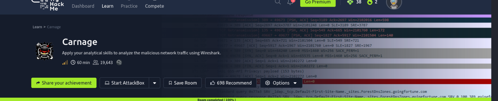

---

## 🧩 Scenario

Eric Fischer from the Purchasing Department at **Bartell Ltd** received a malicious email attachment disguised as a Word document. After clicking **Enable Content**, suspicious outbound traffic was detected by the SOC team.

We were provided with a PCAP file and tasked with identifying the malicious activity.

---

## 🛠️ Tools Used

| Tool | Purpose |
|------|---------|
| Wireshark | Packet capture analysis |
| VirusTotal | Threat intelligence & IP reputation |
| CyberChef | Data decoding |

---

## 📡 Task 2 — Traffic Analysis

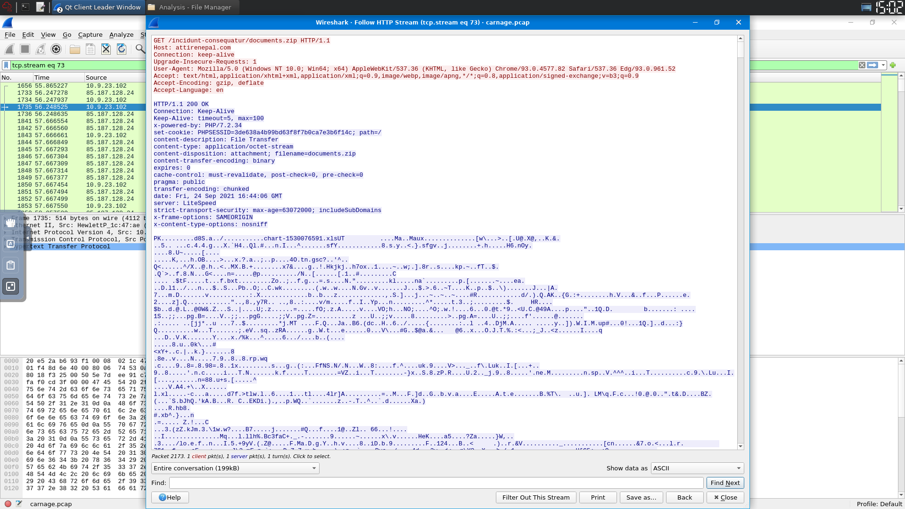

---

### ❓ Q2.1 — What was the date and time for the first HTTP connection to the malicious IP?

**✅ Answer:** `2021-09-24 16:44:38`

**Steps:**

First, configure the timestamp format in Wireshark:
```
Edit → Preferences → Columns → Time → UTC Date and Time
```

Then apply the HTTP filter:
```wireshark
http
```

The first HTTP request to the malicious IP contains the required timestamp.

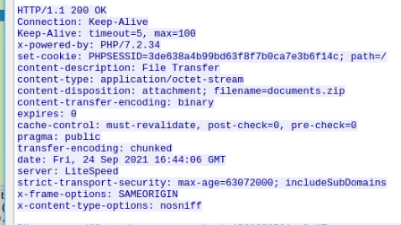

---

### ❓ Q2.2 — What is the name of the zip file that was downloaded?

**✅ Answer:** `documents.zip`

**Steps:**

Using the HTTP packet from Q2.1, inspect the request URI. Follow the stream for full detail:
```
Right Click → Follow → HTTP Stream
```


---

### ❓ Q2.3 — What was the domain hosting the malicious zip file?

**✅ Answer:** `attirenepal.com`

**Steps:**

Expand the HTTP section and check the `Host` header:
```
Hypertext Transfer Protocol → Host
```

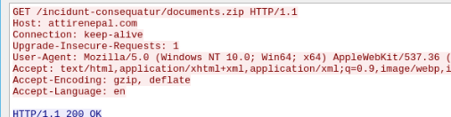

---

### ❓ Q2.4 — Without downloading the file, what is the name of the file inside the zip?

**✅ Answer:** `chart-1530076591.xlS`

**Steps:**

Follow the TCP stream of the malicious connection:
```
Right Click → Follow → TCP Stream
```

The filename is embedded in the raw ZIP archive header — no extraction needed.

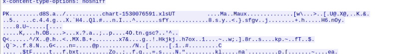

---

### ❓ Q2.5 — What is the name of the webserver of the malicious IP?

**✅ Answer:** `LiteSpeed`

**Steps:**

In the same HTTP response stream, locate the `Server` header in the response headers section.


---

### ❓ Q2.6 — What is the version of the webserver?

**✅ Answer:** `1.6. PHP/7.2.34`

**Steps:**

The version string appears directly below the `Server` header in the HTTP response.


---

### ❓ Q2.7 — What were the three domains involved in malicious file downloads?

**✅ Answer:**
```
finejewels.com.au
thietbiagt.com
new.americold.com
```

**Steps:**

Apply the DNS filter and narrow to the hint timeframe `16:45:11 → 16:45:30`:
```wireshark
dns && (frame.time >= "2021-09-24 16:45:11" && frame.time <= "2021-09-24 16:45:30")
```

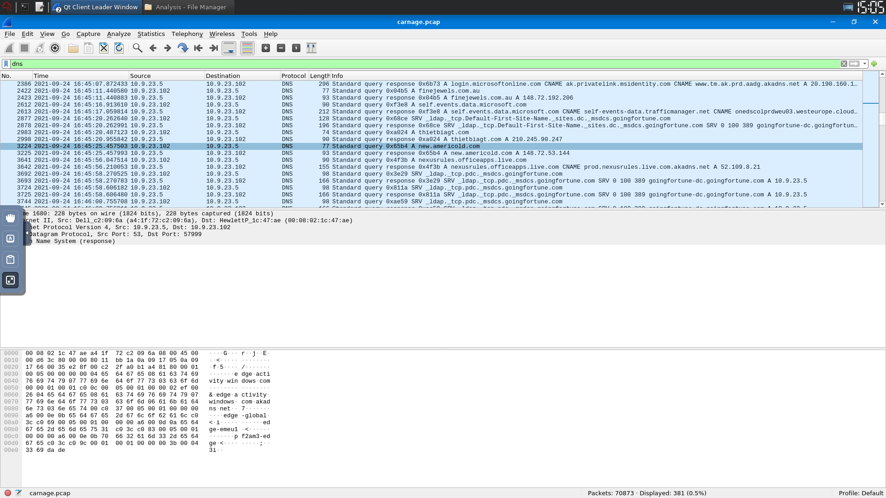

---

### ❓ Q2.8 — Which certificate authority issued the SSL cert to the first domain?

**✅ Answer:** `GoDaddy`

**Steps:**

Follow the TLS stream for `finejewels.com.au`. Inspect the SSL certificate — the issuer field reveals the CA.

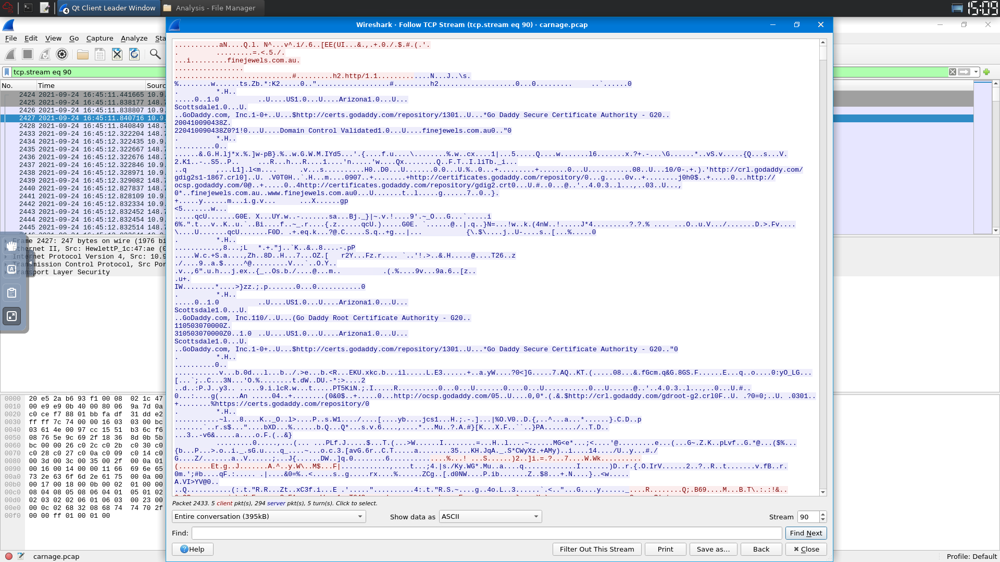

---

### ❓ Q2.9 — What are the two IP addresses of the Cobalt Strike servers?

**✅ Answer:**
```
185.106.96.158
185.125.204.174
```

**Steps:**

Navigate to:
```
Statistics → Conversations → TCP tab → Sort by Packets (descending)
```

Identify top suspicious external IPs → verify on **VirusTotal Community** tab → confirmed as Cobalt Strike C2.

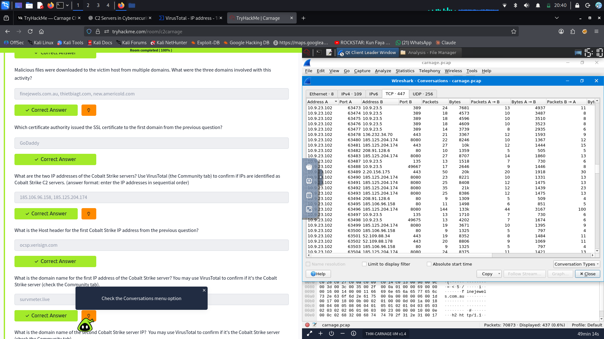

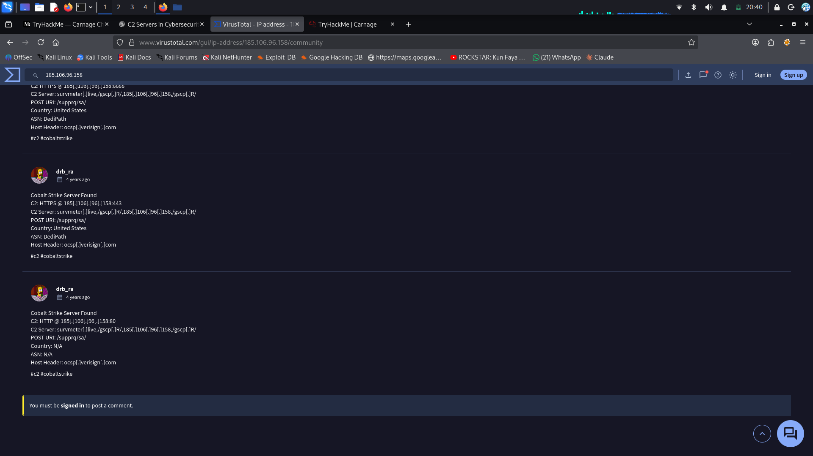

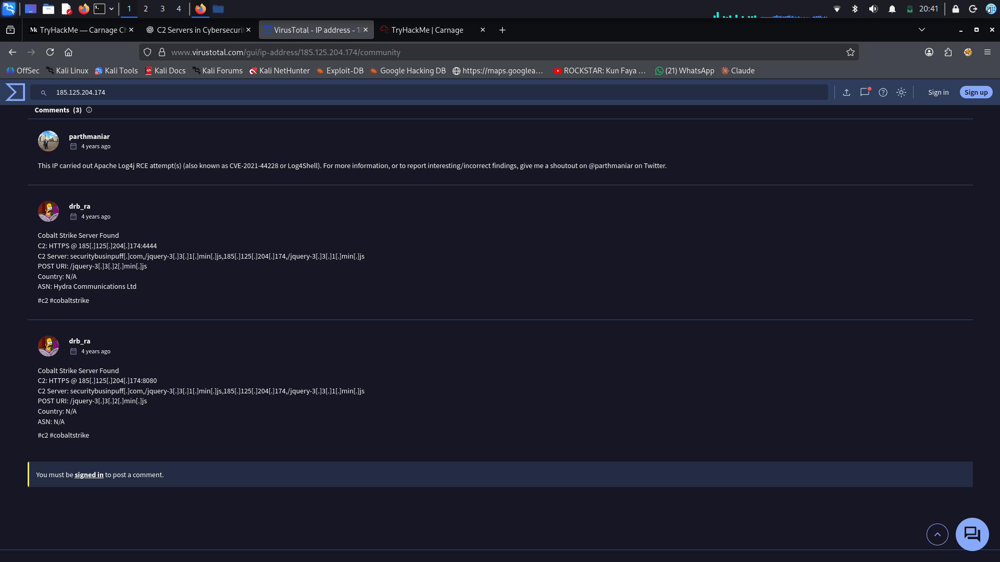

---

### ❓ Q2.10 — What is the Host header for the first Cobalt Strike IP?

**✅ Answer:** `ocsp.verisign.com`

**Steps:**

Filter traffic for the first C2 IP:
```wireshark
ip.addr == 185.106.96.158
```

Follow the HTTP stream → check the `Host` header in the GET request.

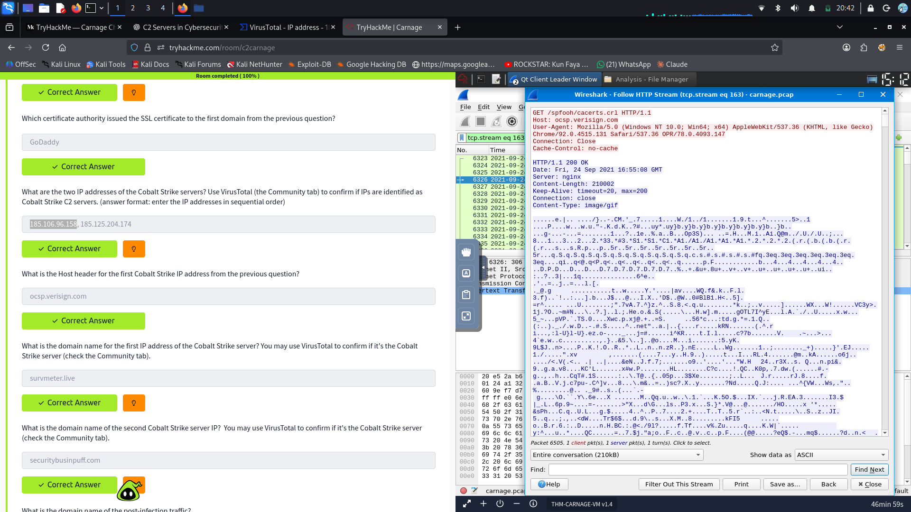

---

### ❓ Q2.11 — What is the domain name for the first Cobalt Strike IP?

**✅ Answer:** `survmeter.live`

**Steps:**

Filter DNS responses that resolve to the first C2 IP:
```wireshark
dns.a == 185.106.96.158
```

Also confirmed via VirusTotal.

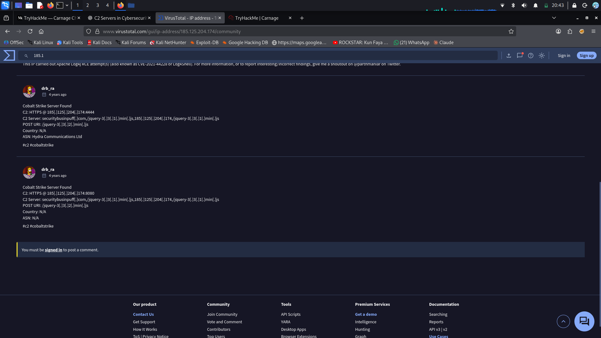

---

### ❓ Q2.12 — What is the domain name for the second Cobalt Strike IP?

**✅ Answer:** `securitybusinpuff.com`

**Steps:**

Filter DNS responses that resolve to the second C2 IP:
```wireshark
dns.a == 185.125.204.174
```

---

### ❓ Q2.13 — What is the domain name of the post-infection traffic?

**✅ Answer:** `maldivehost.net`

**Steps:**

Filter all HTTP POST requests:
```wireshark
http.request.method == "POST"
```

Follow the HTTP stream → the C2 domain used for post-infection beaconing is revealed.

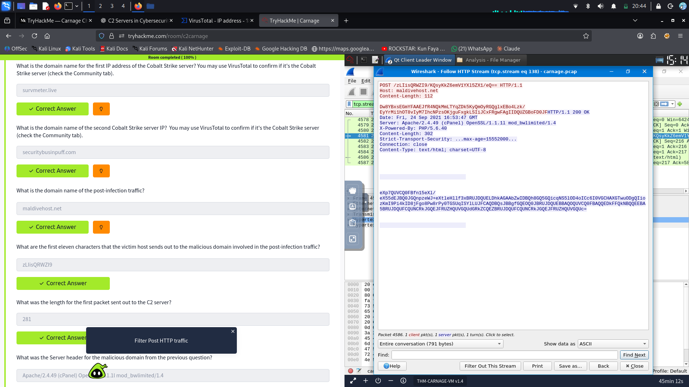

---

### ❓ Q2.14 — What are the first eleven characters the victim sends to the malicious domain?

**✅ Answer:** `LIisQRWZI9`

**Steps:**

Filter all traffic to the C2 host:
```wireshark
http.host == "maldivehost.net"
```

Follow the HTTP stream → extract the first 11 characters of the victim's outbound payload.


---

### ❓ Q2.15 — What was the length of the first packet sent to the C2 server?

**✅ Answer:** `281`

**Steps:**

Select the POST request packet → check the `Length` field in the packet details pane.

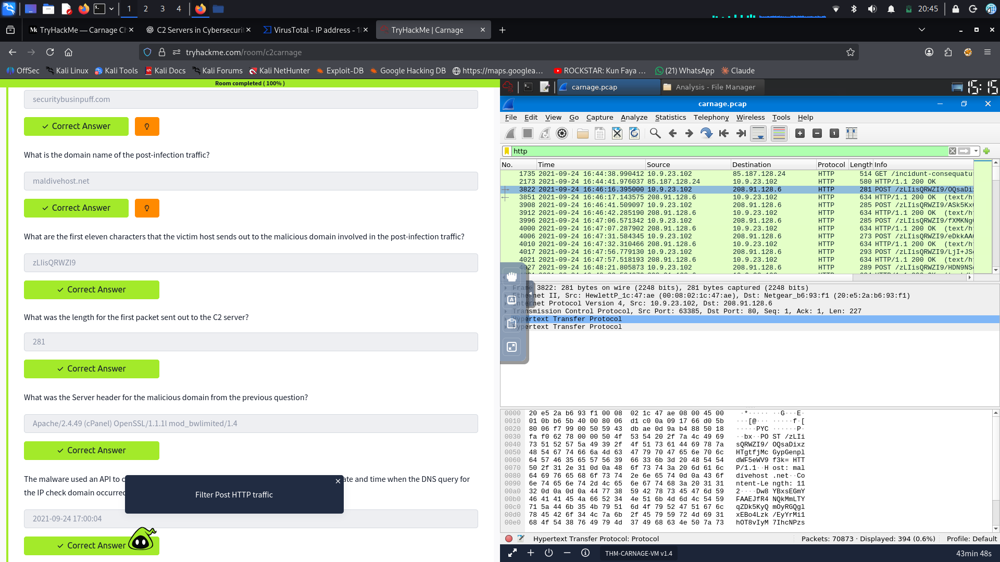

---

### ❓ Q2.16 — What was the Server header for the malicious domain?

**✅ Answer:** `Apache/2.4.49 (cPanel) OpenSSL/1.1.1l mod_bwlimited/1.4`

**Steps:**

In the same HTTP stream from Q2.15, inspect the HTTP response headers and locate the `Server` field.


---

### ❓ Q2.17 — When did the DNS query for the IP check domain occur?

**✅ Answer:** `2021-09-24 17:00:04 UTC`

**Steps:**

The malware queries an external service to discover the victim's public IP. Filter:
```wireshark
ip.addr == 10.9.23.102 && dns && frame contains "api"
```

Note the timestamp from the DNS query packet.

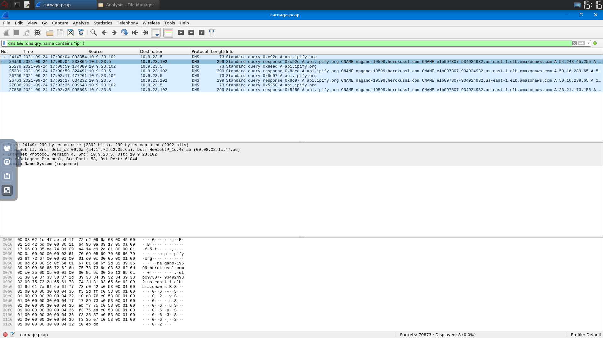

---

### ❓ Q2.18 — What was the domain in the DNS query?

**✅ Answer:** `api.ipify.org`

**Steps:**

Follow the UDP stream from Q2.17. The queried domain is visible directly in the DNS request.

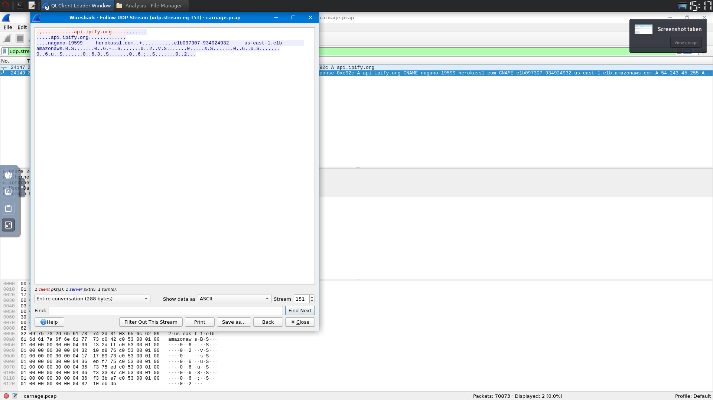

---

### ❓ Q2.19 — What was the first MAIL FROM address observed?

**✅ Answer:** `farshin@mailfa.com`

**Steps:**

Filter SMTP traffic for MAIL FROM commands:
```wireshark
smtp.req.parameter contains "FROM"
```

The first result reveals the attacker's sender address.

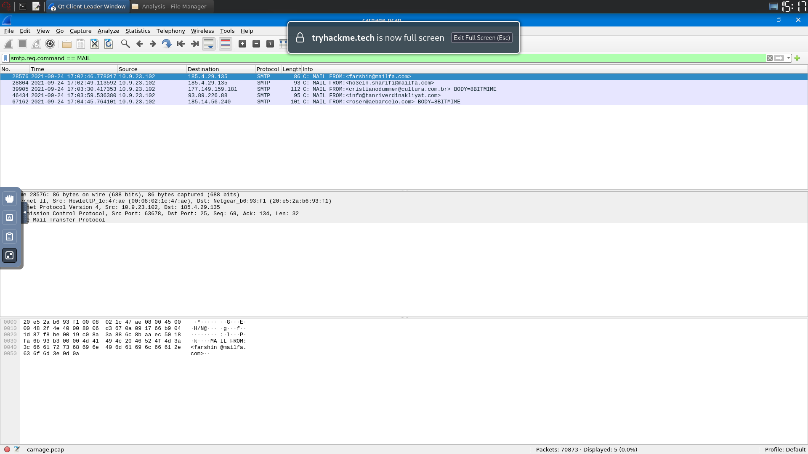

---

### ❓ Q2.20 — How many packets were observed for SMTP traffic?

**✅ Answer:** `1439`

**Steps:**

Apply the SMTP filter and check the total packet count shown in the Wireshark status bar (bottom right).

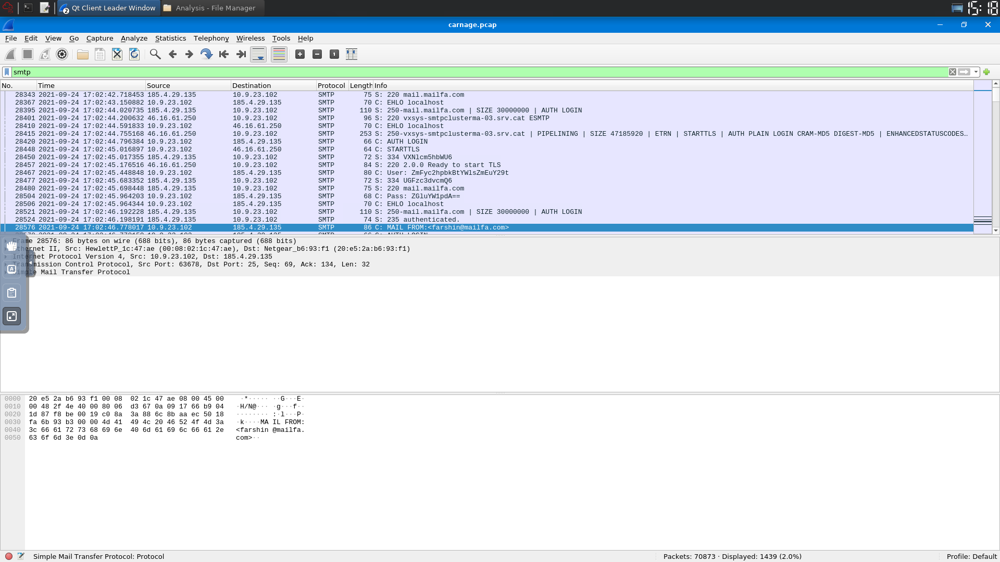

---

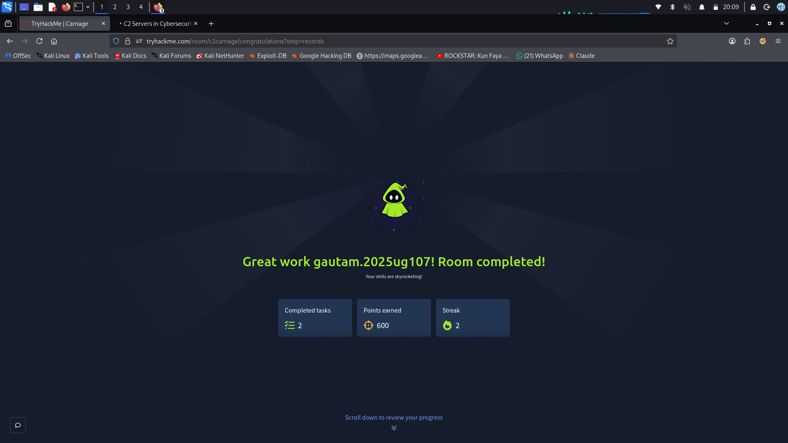

---

## 🏁 Conclusion

This challenge provided hands-on experience in:

- HTTP traffic analysis
- DNS investigation
- SMTP analysis
- SSL certificate inspection
- Threat intelligence enrichment using VirusTotal
- Detecting Cobalt Strike C2 infrastructure
- Following TCP and HTTP streams in Wireshark

> 💡 **Key Takeaway:** Real-world malware doesn't hide in one protocol — it spreads across HTTP, DNS, SMTP, and TLS. Knowing how to pivot across these in Wireshark is an essential blue-team skill.
